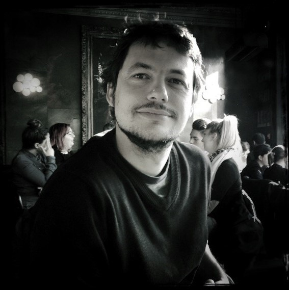

## About Me

Welcome to my personal page.
You'll find here some elements about my professional activities!

I am currently a researcher in the INNOV/DATA-AI department at [Orange Labs Chatillon](https://hellofuture.orange.com/fr/).
My research is about **knowledge engineering** and **dependability**.
Linked to this, I'm interested in,

* Distributed and dynamic systems,
* Datascience and graph theory,
* Coding schemes and high-perf computing.

I hold a Master degree in *telecommunications technologies* from the [Conservatoire National des Arts & Métiers](http://www.cnam.fr/) (CNAM), and got a PhD in Computer Science in 2024, with a thesis on *Anomaly Detection using Knowledge Graphs and Synergistic Reasoning - Application to Network Management and Cyber Security* (supervised by Dr. [Yoan Chabot](https://yoanchabot.github.io/) and Dr. [Raphaël Troncy](https://www.eurecom.fr/~troncy/)).

Enjoy your visit!

Other online channels:

* [LinkedIn](https://www.linkedin.com/in/lionel-tailhardat-566510120/)
* [X (twitter)](https://twitter.com/TailhardatL)
* [ORCID](https://orcid.org/0000-0001-5887-899X)
* [IDHAL](https://cv.archives-ouvertes.fr/lionel-tailhardat)
* [Google Scholar](https://scholar.google.com/citations?user=L3-8tGYAAAAJ)
* [GitHub](https://github.com/GenEars)
* [IETF Datatracker](https://datatracker.ietf.org/person/Lionel%20Tailhardat)
